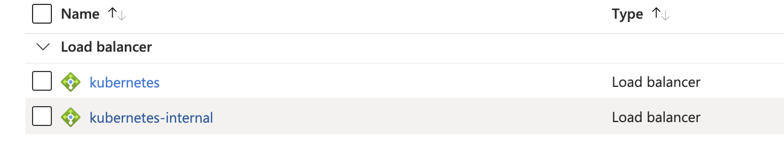

## Azure AKS With Private Link 
Author: Abdelaziz KHAJOUR 
(Azure Cloud Solution Architect)

## Architecture


## Cretae an app deployment and service

```sh
$ az account set --subscription "YOUR_SUBSCRIPTION_ID"
$ az aks get-credentials --resource-group "YOUR_RESOURCE_GROUP" --name "YOUR_AKS_CLUSTER"

$ kubectl apply -f nginx-deployment.yaml  
$ ak-aks kubectl apply -f pls.yaml  
$ kubectl get pods  
$ kubectl get services

```  

## Kubernetes service example
```yaml
apiVersion: v1
kind: Service
metadata:
  name: ak-api-001
  annotations:
    # create ILB instead of ELB; this functionality predates the PLS functionality
    service.beta.kubernetes.io/azure-load-balancer-internal: "true"
    service.beta.kubernetes.io/azure-pls-create: "true"
    service.beta.kubernetes.io/azure-pls-name: YOUR_PLS_NAME
    service.beta.kubernetes.io/azure-pls-ip-configuration-subnet: YOUR_PLS_SUBNET_NAME
    service.beta.kubernetes.io/azure-pls-ip-configuration-ip-address-count: "1"
    # The following IP address must be available in pls-subnet
    service.beta.kubernetes.io/azure-pls-ip-configuration-ip-address: 10.224.10.10 
    service.beta.kubernetes.io/azure-pls-fqdns: "akfqdn001"
    service.beta.kubernetes.io/azure-pls-proxy-protocol: "false"
    service.beta.kubernetes.io/azure-pls-visibility: "*"
    service.beta.kubernetes.io/azure-pls-auto-approval: "YOUR_SUBSCRIPTION_ID"
spec:
  selector:
    app: ng
  type: LoadBalancer
  ports:
  - port: 80
    targetPort: 8080

```

## Kubernetes service example

```yaml
apiVersion: apps/v1
kind: Deployment
metadata:
  name: nginx
  labels:
    app: nginx
spec:
  replicas: 1
  selector:
    matchLabels:
      app: nginx
  template:
    metadata:
      labels:
        app: nginx
    spec:
      containers:
      - name: nginx
        image: nginx:latest
        imagePullPolicy: Always
        ports:
        - containerPort: 8080
          protocol: TCP
```


## Check the created Private Link in Azure portal


## Check the created Internal Load Balancer in Azure Portal



Thank you for your suggestions